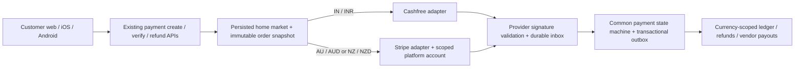

# Fe3dr: India, Australia and New Zealand expansion

Status: analysis and API foundation; not a launch approval. Reviewed 30 September 2026.

## Requested behaviour

| Account home market | Currency | Only permitted payment provider | Launch state |
| --- | --- | --- | --- |
| India (IN) | INR | Cashfree | Existing market; preserve current behaviour |
| Australia (AU) | AUD | Stripe | Planned; onboarding and payment enablement blocked |
| New Zealand (NZ) | NZD | Stripe | Planned; onboarding and payment enablement blocked |

No Stripe account exists yet. The owner has a business; its legal registration country/countries still need confirmation. Do not activate AU/NZ transactions or create live connected accounts from this scaffold.

## What exists, and the gaps

| Area | Evidence in repository | Consequence |
| --- | --- | --- |
| Payment selection | `apps/api/services/gateway_select.go:35-66`, `:143-151` | Selection follows kitchen `PaymentProvider` through `SelectCheckoutGateway`, with non-Stripe values routed to Cashfree; this is not a signup-country policy. |
| Provider mutation | `apps/api/handlers/stripe_connect.go:42-111` | Vendors can select a provider. Future country rules must be enforced here and in every payment entry point, not only hidden in clients. |
| Stripe Connect | `apps/api/services/stripe.go:41-108`, `:257-290`, `:503-539` | Existing Express account, PaymentIntent and transfer primitives are useful, but must be validated against the chosen platform account countries and settlement model. |
| Stored kitchen data | `apps/api/models/payment_provider.go:51-117` | Country, Stripe account and readiness fields exist; account-country provenance and tenant/platform-account scoping need strengthening. |
| Signup account | `apps/api/models/user.go:31-103`; `apps/api/handlers/internal_users.go:165-213` | User has no persisted immutable home-market field. Auth/BFF provisioning must carry a validated selection and bind identities consistently. |
| Currency fallback | `apps/api/services/currency.go:46-96` | AU/NZ currencies are mapped, but unknown countries fall back to INR. Unsupported markets must fail closed in the new flow. |
| Customer native checkout | `apps/mobile-customer/lib/payment.ts:48-116`; `lib/payment-provider.ts` | Cashfree native checkout is implemented; Stripe is only recognized by the helper and rejected by the checkout launcher. Add Stripe PaymentSheet and authoritative server verification. |
| Vendor onboarding | `apps/mobile-vendor/app/(onboarding)/documents.tsx`, `payout.tsx` | FSSAI/GSTIN and IFSC assumptions are India-specific. AU/NZ food registration, tax identifiers and bank setup need separate policies. |
| Settlement | ADRs `0001`, `0002` (partly superseded), `0003`; existing issues #403, #736, #1076 | Existing Indian Cashfree economics, holds, tax deductions and split/clawback logic cannot simply be applied to Stripe. Explicitly reconcile ADR history before implementation. |
| Secrets | `apps/api/internal/appsecrets/openbao.go:20-65` | OpenBao integration exists but uses production-specific names/paths. New Stripe credentials must have separate market and environment scope; never enter them in GitHub issues or app bundles. |
| Infrastructure | `tesserix-k8s` HomeChef charts/Argo apps | Existing deployment configuration is shared, and registry names reference `asia-south1`. A registry location alone is not proof of database, backup or application data residency. Inventory actual locations before making claims. |

## Proposed architecture and decisions

1. Persist `home_market` separately from display locale, device location, phone prefix, nationality, card issuer, currency formatting and temporary delivery address. Country selection at signup is explicit; the server validates it. Geo-IP may suggest, never authorize.
2. Vendors bind to their verified legal/kitchen country. Customers select an account home market and use a matching serviceable delivery address. **Proposed launch rule:** only same-market customer/vendor orders. Cross-border ordering and account moves require a later explicit design; travel does not silently change provider.
3. Store a server-resolved immutable snapshot on each order/payment: market, currency, provider, platform account reference and vendor destination. All retries, refunds, reconciliation and transfers use this snapshot, not today's profile fields or a caller-supplied provider.
4. Enforce IN→Cashfree, AU/NZ→Stripe at signup completion, vendor provider mutation, cart/order validation, regular/group/meal-plan checkout, retries and all payout paths. Clients only render server capabilities. No automatic fallback to another rail on an outage.
5. Launch availability is separate from the provider mapping. A planned Stripe market remains closed until its entity/account, KYC, webhook, payout, privacy and support gates pass. India remains available; provider-specific vendor readiness still applies.
6. Keep a single service initially. Introduce market-aware policy and account references before deciding to split regional deployments. A regional split affects auth, DB, object storage, queue/cache, analytics and backups and is not just an API hostname change.
7. Use minor-unit integers and explicit currency for new payment contracts. Do not convert existing Indian balances into AUD/NZD or mix currencies in one ledger/statement. Reuse and link existing money-migration issue #396.
8. API additions are additive/versioned. Existing records are backfilled only after an inventory proves their market; do not infer every historical Stripe vendor is Indian. Capture recoverable state and use reviewed migrations with rollout gates.

### Implemented foundation in this change

- `GET /api/v1/markets` and `GET /api/v1/markets/{country}` in `apps/api/internal/markets`.
- IN/Cashfree/INR is `active`; AU/Stripe/AUD and NZ/Stripe/NZD are `planned`.
- Unknown markets return 404 and stable `unsupported_market`; lowercase/outer whitespace are normalized by policy lookup.
- Public, non-sensitive discovery, under existing API middleware. No credential calls, migrations, signup changes or payment routing changes.
- This API is **not payment authorization**. `active` indicates market launch status, not vendor KYC/readiness or guaranteed payment availability. The later checkout enforcement work is mandatory.
- OpenAPI: `markets.openapi.yaml`. Tests cover mappings, launch states, normalization, unsupported markets and HTTP response contracts.

### Shared API target

This is the target architecture. The initial scaffold exposed discovery metadata. The Stripe sandbox development increment below adds checkout routing, payment safety fixes and native PaymentSheet; durable Stripe inbox, persisted customer country binding and the remaining parity fixes are still tracked implementation work.

### Subsequent API contracts to agree before implementation

- Auth provisioning: validated `home_market` carried through signup/BFF/internal user provisioning; omitted for existing-login compatibility, mandatory for genuinely new accounts once clients roll out.
- `GET /api/v1/me/market`: persisted market, policy version, effective customer capabilities; authenticated.
- Payment creation: continue existing endpoint shape where possible; server derives provider/currency, requires an idempotency key, snapshots market/account references, returns a discriminated Cashfree or Stripe client payload. Never trust supplied totals or account IDs.
- Vendor onboarding/status: server derives provider; Stripe-hosted Connect links are short-lived with allowlisted return URLs; `charges_enabled`, `payouts_enabled`, capabilities and requirements determine readiness.
- Webhooks: separate signing configuration per account/environment, raw-body signature verification, unique `(provider, platform_account, event_id)` inbox, replay/out-of-order safety and durable retries. App callback success is not proof of payment.
- Refund/dispute/payout APIs: operate on original transaction references, reserve balances atomically and reconcile external outcomes. A refunded charge does not automatically reverse a separate Connect transfer.

## Stripe research and account setup

Sources are official and were read on 30 September 2026; dashboard availability must be rechecked during account onboarding.

- [Global availability](https://stripe.com/global): Australia and New Zealand are supported account countries. This alone does not authorize cross-border marketplace vendor payouts.
- [Separate charges and transfers](https://docs.stripe.com/connect/separate-charges-and-transfers): AU and NZ are supported; Stripe describes restrictions on cross-border transfers. Do not assume an AU platform account can transfer to NZ connected accounts. Confirm the exact charge model and country pair with Stripe before committing to a single-account design.
- [Cross-border payouts](https://docs.stripe.com/connect/cross-border-payouts): self-serve coverage described for the US, UK, EEA, Canada and Switzerland is not an AU↔NZ approval. Stripe directs other cases to sales/support.
- [Express accounts](https://docs.stripe.com/connect/express-accounts): platform country, connected-account country, capabilities, business type and liability determine the supported setup. Validate existing Express usage against current Connect recommendations.
- [Payment acceptance](https://docs.stripe.com/payments/accept-a-payment) and [API keys](https://docs.stripe.com/keys): use test/sandbox mode first; Stripe-native UI collects card details, backend uses secret keys. Publishable keys are client-side; secret keys and webhook signing secrets are not.
- Existing settlement logic uses holds and later release. **Do not describe a standard Stripe platform balance as regulated escrow.** Stripe's separate-transfers documentation describes funds segregation as a private-preview feature; confirm permitted holding periods and liabilities with Stripe.
- The platform must reconcile charge refunds and transfer reversals explicitly, cover negative balances/disputes and document commission/refund treatment.

### Owner setup sequence (do not create live transactions yet)

1. Confirm your business's legal country/countries, entity name/type, beneficial owners and the countries where vendors will operate. Identify who is merchant/platform of record with your accountant/legal adviser.
2. Create a Stripe account under the real legal entity's country. Enable MFA and least-privilege team access. Do not choose an account country solely because customers live there.
3. Use a sandbox/test environment. Configure Connect for a food marketplace, describing customer capture, fulfillment delay, vendor transfers, refunds and disputes accurately.
4. Ask Stripe to confirm AU-platform→AU-vendor and proposed NZ-vendor flows, currencies, connected-account types, holding period and liability. If AU→NZ is unsupported, confirm whether a NZ legal entity and separate platform account are required. NZ stays planned until resolved.
5. Complete identity/business verification and settlement bank details in Stripe's dashboard. Provide public business/contact details, refund/delivery policies, platform terms and vendor agreement. The owner completes KYC; do not send identity documents or keys through chat/GitHub.
6. Add account-scoped test keys and webhook secrets through the approved OpenBao writer. Proposed names: `fe3dr-stripe-au-secret-key`, `fe3dr-stripe-au-webhook-secret`, equivalents for NZ, separated into development/UAT/production paths and namespace-bound readers. Extend the existing secret mapper and rotation/writer jobs first.
7. Run test customer payments (success/decline/3DS), Connect onboarding, payout-disabled vendors, refunds before/after transfer, transfer reversal, disputes, duplicate/out-of-order webhooks and reconciliation.
8. Finalize privacy/tax/food-registration requirements, production webhooks and monitored rollout/rollback. Activate live mode and one market at a time only after explicit rollout approval.

## Data locality: findings and required inventory

**Provider country, customer market and data storage location are different controls.** A Stripe AU/NZ account does not establish local-only storage.

- [Stripe DPA §6](https://stripe.com/legal/dpa) states users transfer personal data to Stripe LLC in the US and Stripe/affiliates may transfer it globally. [Stripe privacy policy §6](https://stripe.com/privacy) also describes international transfers, including the US and India. Do not promise AU-only/NZ-only processing without a specific supported contractual arrangement.
- [OAIC APP 8 guidance](https://www.oaic.gov.au/privacy/australian-privacy-principles-guidelines/chapter-8-app-8-cross-border-disclosure-of-personal-information): where applicable, reasonable steps and accountability attach to overseas disclosures, subject to exceptions. The distinction between disclosure and processing under effective control matters. It is not a blanket Australia-only hosting rule.
- [NZ Privacy Principle 12](https://www.privacy.org.nz/privacy-principles/12/): overseas disclosure requires an applicable basis, including comparable safeguards or another stated exception. Assess service-provider agency/use separately; do not assume a consent checkbox solves every transfer.
- Retain India's current payment-data obligations and Cashfree boundary; obtain current counsel/provider confirmation before exporting Indian payment records. No conclusion about RBI/DPDP applicability or satisfaction is asserted by this scaffold.

Inventory before a regional deployment decision:

| Data class | Evidence and decision needed |
| --- | --- |
| Identity, sessions and MFA | Zitadel/auth BFF, Firebase, SMS/email vendors, session/cache regions, support access and retention |
| User/kitchen/order data | Primary DB physical region, replicas, backups/PITR, exports and restore target; row-level market and tenant access |
| Images, food licences, identity uploads | Bucket location, CDN/cache origins, signed URLs, retention and deletion; avoid duplicating Stripe KYC documents |
| Payment metadata | Stripe/Cashfree account and processing terms, references and amounts retained locally; no card PAN/CVC storage |
| Telemetry and support | Logs, traces, analytics, crash reporting, support/AI tools and international operator access; redact PII and secrets |
| Secrets and recovery | OpenBao namespace/market/env paths, replicas, audit logs, encrypted backups and tested isolated restore |
| Recovery | RTO/RPO per market, failover-region choice, documented transfer impact and rollback tests |

Proposed regional deployment options must be costed after this inventory: retain shared processing with lawful disclosures vs separate AU data plane (and NZ-local plane only if required). Do not migrate production data or provision regional infrastructure in this discovery phase.

## Delivery order and release gates

1. Entity/Connect feasibility and privacy inventory; API discovery scaffold and contract tests.
2. Persisted home market, compatibility/backfill strategy and server-only routing enforcement.
3. AU/NZ vendor onboarding, Stripe credentials/webhooks and customer web/native checkout.
4. Currency/tax/accounting, refunds/disputes/settlement, subscriptions/group/meal-plan parity.
5. Isolated sandbox/UAT end-to-end tests; India regression matrix; security, restore and operational sign-off.
6. Reviewed PRs and successful builds; explicitly approved India-safe, AU-first canary, NZ only after feasibility gates; monitor and rollback through GitOps.

No commit, PR, merge, production migration or rollout is included in this initial analysis/scaffold stage.

## GitHub delivery tracking

All issues assigned to `Sam123ben`.

- [[Epic] Launch Fe3dr in IN/AU/NZ with country-bound Cashfree/Stripe payments](https://github.com/tesserix/Home-Chef-App/issues/1222)
- [[Markets] Add versioned market discovery API and contract tests](https://github.com/tesserix/Home-Chef-App/issues/1223)
- [[Stripe] Confirm AU/NZ legal entities, Connect corridors and sandbox setup](https://github.com/tesserix/Home-Chef-App/issues/1224)
- [[Markets] Persist and validate account home market across signup and BFF](https://github.com/tesserix/Home-Chef-App/issues/1225)
- [[Payments] Enforce immutable market/provider/currency at every checkout](https://github.com/tesserix/Home-Chef-App/issues/1226)
- [[Stripe] Scope credentials and webhook secrets by market and environment](https://github.com/tesserix/Home-Chef-App/issues/1227)
- [[Payments] Add account-scoped Stripe webhook inbox and reconciliation](https://github.com/tesserix/Home-Chef-App/issues/1228)
- [[Checkout] Add Stripe PaymentSheet and country-specific customer web/mobile UI](https://github.com/tesserix/Home-Chef-App/issues/1229)
- [[Onboarding] Add market-specific vendor verification and Stripe Connect UI](https://github.com/tesserix/Home-Chef-App/issues/1230)
- [[Finance] Define AU/NZ settlement, refunds, disputes and tax policies](https://github.com/tesserix/Home-Chef-App/issues/1231)
- [[Privacy] Audit IN/AU/NZ data flows, residency and cross-border obligations](https://github.com/tesserix/Home-Chef-App/issues/1232)
- [[Markets] Localize serviceability, addresses, schedules and marketplace policies](https://github.com/tesserix/Home-Chef-App/issues/1233)
- [[Release] Validate and roll out AU then NZ with India regression and rollback](https://github.com/tesserix/Home-Chef-App/issues/1234)

## Shared payment API audit

Parent: #1222. Required by owner: Cashfree and Stripe must use the same backend and public payment APIs; provider selection is an internal market decision.

## Preserve existing contracts

- `POST /api/v1/payments/order/:orderId/create`
- `POST /api/v1/payments/order/:orderId/verify`
- `POST /api/v1/payments/order/:orderId/refund`

Keep auth/ownership rules, order lifecycle, outward errors and existing response field compatibility. `provider` discriminates the already-existing Cashfree vs Stripe SDK payload. Do not rename existing fields or introduce parallel country-specific checkout APIs. Provider webhook URLs remain separate because their signature formats differ.

## Audited blockers (30 September 2026)

- `handlers/payment.go:41-121` parses wallet/loyalty intent but only passes it to Cashfree; `createStripePayment:188-264` charges full order total.
- `createStripePayment` computes `ChefNetPayoutFor` with existing India-oriented economics. It creates a destination charge (`services/stripe.go:257-290`), not the later-transfer settlement described by older payout ADRs. Reconcile with approved AU/NZ charge model before activation.
- Stripe creation has no caller idempotency key and ignores the database update result when persisting intent/provider. Repeated checkout and timeout-after-success must not charge twice or strand an intent.
- `verifyStripePayment:323-381` checks ID/status, but not expected amount/currency/account. It logs a transaction failure and still responds HTTP 200/completed. Persist/emit completion atomically and return retryable failure on DB error.
- `StripeWebhook:997-1042` dispatches events without a durable account-scoped inbox and acknowledges handler failures; `handleStripePaymentSucceeded:1044-1085` directly updates state then performs side effects outside the common transactional completion/outbox flow.
- Existing Stripe refunds already set `ReverseTransfer` and `RefundApplicationFee` (`payment.go:796-838`) for destination charges. Preserve this distinction; a future separate-transfer flow requires its own explicit reversal handling.
- Customer mobile recognizes provider=stripe but does not launch Stripe checkout (`apps/mobile-customer/lib/payment.ts:48-116`).

## Acceptance criteria

- [ ] Contract tests run identical create/verify/refund route and ownership cases against both provider adapters, with backwards-compatible existing payload fields.
- [ ] Server derives market/provider/currency from persisted identity/order; no caller-controlled routing or silent provider fallback. Work with #1225 and #1226.
- [ ] Decide market-scoped wallet/loyalty rules; reject unsupported credits before external side effects or apply the same funding plan accurately. Do not mix INR wallet balances with AUD/NZD.
- [ ] Idempotent creation/reuse, concurrency control and recoverable persistence; account/mode-bound references for every operation.
- [ ] Verify amount/currency/account/order and successful provider status; never acknowledge completed before database commit/outbox success.
- [ ] Webhook and polling verification converge on the same atomic state machine; retries heal side effects, no duplicate rewards, notifications, transfers or completion events (#1228).
- [ ] Market-specific payout/tax models and refund/transfer conservation tests (#1231); existing Cashfree flows regress unchanged.
- [ ] Native/web Stripe adapters consume the existing response contract and complete 3DS/resume/cancel tests (#1229).
- [ ] Cover regular/group/meal-plan, partial and full refunds, driver payouts, disputes and support/admin operations; record unsupported capabilities as closed launch gates.

## Validation

Use local HTTP fake providers plus database failure injection before sandbox tests. Add golden/contract assertions for current Indian clients and Stripe callers. Live credentials are not needed for these tests. No production rollout as part of this issue.

Gateway parity implementation: [#1235](https://github.com/tesserix/Home-Chef-App/issues/1235), assigned to `Sam123ben`.

## Verified infrastructure observations (read-only, 30 September 2026)

- Active cluster: `gke_tesseracthub-480811_asia-south1_tesseract-prod-in-gke`, project `tesseracthub-480811`; all observed nodes are in `asia-south1` across its a/b/c zones.
- Namespace `homechef` hosts the API, auth BFF, worker, portals and three-instance `homechef-postgres` CNPG cluster. This confirms the current shared application/database compute is in India, not Australia/New Zealand.
- `homechef-prod-assets-in` and `homechef-prod-docs-in` report bucket location `ASIA-SOUTH1`.
- These observations do not prove backup/export/replica/CDN/subprocessor locality. Those remain #1232's inventory work. No data, credentials, infrastructure configuration or workloads were changed.

## Scaffold validation

- Red test first: market package failed because Lookup/RegisterRoutes/Policy were absent.
- `go test -race ./internal/markets`: passed, including country and HTTP subtests.
- `go test ./...`: passed across all API packages (16 packages reported passing tests).
- `go vet ./...` and `go build ./...`: passed.
- `git diff --check`: passed.
- This validates the additive discovery scaffold, not production Stripe payment readiness; #1235 remains required.

## Charge-model-specific Stripe clarification

The existing backend uses **destination charges** (`transfer_data[destination]` plus `application_fee_amount`), not separate charges and transfers. [Stripe destination-charge documentation](https://docs.stripe.com/connect/destination-charges) says cross-region setups generally require the connected account to be the settlement merchant using `on_behalf_of`, with exceptions. The current `StripePaymentIntentRequest`/creation path does not send `on_behalf_of`. Therefore separate-transfer restrictions must not be generalized into a blanket claim that AU→NZ destination charges are impossible. Confirm this exact corridor, capabilities, account/service-agreement eligibility and settlement-merchant/consumer responsibilities with Stripe. The implementation choice (destination vs separate transfers) must also satisfy Fe3dr's approved fulfillment/settlement model.

## Pricing and settlement economics to model

Official public pages checked on 30 September 2026; actual account pricing/eligibility and effective dates must be confirmed at setup, not hardcoded into fee logic:

- [Australia pricing](https://stripe.com/au/pricing) displays 1.7% + A$0.30 for domestic cards and 3.5% + A$0.30 for international cards, **with explicit lower-price effective-date notices of 1 October 2026 and 1 April 2027 respectively**. Do not assume these displayed future rates apply to today's transactions. The page says card fees include GST.
- [New Zealand pricing](https://stripe.com/nz/pricing) displays 2.65% + NZ$0.30 domestic and 3.5% + NZ$0.30 international. Confirm FX, dispute/refund treatment, optional products and account-specific terms separately.
- [AU Connect pricing](https://stripe.com/au/connect/pricing) distinguishes Stripe-handled connected-account pricing from platform-handled pricing. The latter displays A$2 per monthly active account and 0.25% + A$0.25 per payout; confirm the applicable Connect plan and all volume/routing/cross-border/instant-payout fees before estimating margin. These are not NZ price quotes.
- Model payment fees, Connect/account costs, payout frequency, FX, refund leakage, disputes/negative balances, tax on commissions, driver payments and support costs independently. Preserve a configurable market-scoped fee policy; do not reuse Indian payout deductions as AU/NZ defaults.

## Local iOS setup and limits

Xcode 26.6 and iOS 26.5 are installed. Both generic arm64 simulator builds passed. On 2026-09-30 both apps were visually verified on separate iPhone 17 simulators: customer food catalogue and vendor sign-in screen.

Recovery required restarting the stale CoreSimulator service, stopping only orphan processes whose open files proved ownership by the two Fe3dr devices, and creating a clean customer device. The original customer device remains shut down, not deleted. Customer: `FADBB54A-50DD-4141-AA74-7F8581765394`; vendor: `F9F0C628-4178-48CB-B267-D74D4C03AA74`.

Metro must load the existing `build.prod-sim.env` public configuration from each app's `eas.json`; plain `expo start` omitted `EXPO_PUBLIC_BFF_URL` and caused AuthProvider to throw. Customer's native debug build expects port 8081. Vendor uses port 8092 and development URL `exp+homechef-vendor://expo-development-client/?url=http%3A%2F%2F127.0.0.1%3A8092`. Avoid port 8082 (another local application uses IPv4) and literal IPv6 development URLs (Expo's network inspector asserted on `ws://::1`).

Screenshots: `artifacts/simulator-recovery-2026-09-30/customer.png` and `vendor.png`. Both bundles loaded and rendered. Unsigned simulator builds still log an expo-notifications keychain registration warning. Authenticated flows, push delivery and payment e2e are **not verified**. No production resources changed.

## Stripe sandbox development increment (30 September 2026)

The existing create/verify/refund route names remain unchanged. Local changes now include:

- New order payments route by the server-stored kitchen payout country and the order's frozen currency: IN/INR → Cashfree; AU/AUD and NZ/NZD → Stripe. Existing gateway references preserve retry routing. This is not yet immutable customer signup/home-country enforcement (#1225).
- AU/NZ are still `planned`; new live checkouts return `market_not_enabled`. Sandbox Stripe creation checks credential mode and publishable-key mode. No live rollout is included.
- Stripe creation sends an order-derived idempotency key, fetches an already-stored intent on retry, validates the response and checks database persistence before returning its client secret.
- Verification and successful webhooks bind the intent to the stored order/provider, currency, requested amount, received amount and test/live environment. Completion and order/chef events use the common transactional outbox. Storage failures produce retryable HTTP failure instead of false success. A concurrent refund cannot be reported as completed.
- Unsupported Stripe wallet/loyalty requests fail before any gateway call. INR balances must not fund AUD/NZD orders.
- Customer native checkout uses Stripe PaymentSheet 0.64.0, the version declared by Expo SDK 57. Success calls the same order verify API; cancellation does not verify. A verification network failure returns to the existing order result screen. Payment secrets remain out of route parameters. Runtime version `1.0.1-stripe.1` requires a new native binary.

Remaining release blockers are intentionally not represented as complete: per-market/platform-account OpenBao credentials and rotation, authoritative customer home market, frozen connected-account binding, durable account-scoped webhook inbox and failure/refund handlers, country-specific tax/commission/settlement/refund conservation, customer web Elements integration, and real success/decline/3DS/Connect/refund tests. Existing destination-charge fee computation is still the India-oriented policy and is not approved for AU/NZ production. The live-market gate must remain until these are resolved.

The local simulator still uses the existing public production backend URLs for basic app startup, not the unmerged local Stripe API. Its catalogue/sign-in smoke check is not proof of a sandbox payment. Real testing needs a Stripe sandbox, configured test credentials through OpenBao, test connected accounts, a test backend deployment and the existing test user's credential location. No account password or Stripe secret has been requested in chat, written to an issue or committed.

### Stripe increment validation

- `go test -race ./...`, `go vet ./...`, and `go build ./...`: passed after the final webhook/notification and concurrent-refund fixes.
- Customer Jest suite: 30 suites / 212 tests passed; `pnpm exec tsc --noEmit`: passed.
- `pnpm exec expo export --platform android --output-dir /tmp/fe3dr-stripe-android-export`: passed. This is a JavaScript bundle export, not an Android native/device test.
- Expo prebuild and CocoaPods installation passed with Stripe native SDK 25.11.0.
- `pnpm dlx expo-doctor@1.20.4` reported 22 existing Expo packages behind recommended patches; the added Stripe React Native 0.64.0 matches SDK 57. No unrelated dependency upgrade was made.
- `git diff --check`: passed; repository context graph refreshed with `graft build`.
- Changes remain local and uncommitted. No CI, merge, deployment or real Stripe transaction is claimed. Test-account credentials and Stripe sandbox/account configuration remain unavailable.

- Stripe-enabled iOS arm64 simulator Debug build passed using `xcodebuild -workspace ios/Fe3dr.xcworkspace -scheme Fe3dr -sdk iphonesimulator -configuration Debug -destination "generic/platform=iOS Simulator" -derivedDataPath /tmp/fe3dr-customer-derived CODE_SIGNING_ALLOWED=NO ONLY_ACTIVE_ARCH=YES ARCHS=arm64 -quiet`.

- Installed the rebuilt customer binary on its iPhone 17 simulator and visually verified the catalogue; vendor sign-in remains visible on the second simulator. Evidence: `artifacts/stripe-simulator-2026-09-30/customer.png` and `vendor.png`. Existing unsigned-build notifications/keychain warning remains visible in logs. These checks use the existing production public backend configuration and do not validate local Stripe checkout or authenticated journeys.

## Second integration and localization review (1 October 2026)

**Readiness: development/sandbox only. Multi-country production acceptance has not passed.** The earlier discovery and audit sections describe historical state; this section and the sandbox increment record the current local changes. No commit, deployment, migration or real gateway transaction was performed during this review.

### Defects reproduced and corrected

- Delivery quote selected a gateway from the editable chef preference while order payment used market policy. Quote now uses `OrderCheckoutProvider`, including anonymous responses, and omits unsupported Stripe wallet/loyalty credit previews. IN remains Cashfree; AU/NZ resolve to Stripe. Unsupported markets return `422 unsupported_market`.
- Vendor gateway switching could override country policy. `SetPaymentProvider` now rejects incompatible providers with `422 market_provider_mismatch`, and reports persistence failures.
- Chef and driver Stripe Connect creation accepted a caller-selected country and defaulted to the US. These endpoints now require the stored AU/NZ payout country, reject overrides and malformed JSON, preserve the stored country, and check account persistence before returning onboarding links. This does **not** make the stored country immutable or solve Connect account-create idempotency.
- Customer checkout and order history/detail/receipt treated all major-unit amounts as rupees; the order mapper discarded the API currency. These surfaces now preserve transaction currency and format INR/AUD/NZD explicitly. Existing Indian grouping remains. This is not FX conversion or complete catalogue/refund/loyalty localization.
- Native and web checkout defaulted wallet and loyalty on even for Stripe. Both now use the shared `checkoutCreditIntent` before creating an order: Cashfree preserves customer choices, Stripe sends no unsupported credit requests, and missing/unknown quote gateways stop checkout.
- Web checkout called Stripe `confirmPayment` without mounting a payment-details form. It now mounts a Payment Element, blocks submission until ready, handles decline/cancellation, destroys the element on exit, and verifies through the existing payment API. Only a backend `completed` response is announced as success; pending/network-uncertain outcomes return to the order without a false success message.
- Stripe.js loader coalesced SDK instances across distinct publishable keys and could not recover from script load failure. It now shares only script loading, initializes each key separately, bounds loading to 15 seconds, and supports retry after failure.
- Stripe redirect verification no longer announces pending as confirmed and removes Stripe return parameters, including the client-secret parameter, after verification. Provider-unknown mobile copy no longer claims RBI licensing.

### Remaining acceptance gates

| Area | Finding / outstanding implementation | Tracking |
| --- | --- | --- |
| Signup / identity | Customer home market is not persisted/enforced across signup, BFF and provisioning. Current routing uses kitchen payout country, not the requested immutable signup-country rule. Country changes and historical order/account binding still need a reviewed migration. | #1225, #1226 |
| Addresses / serviceability | Mobile `app/address/add.tsx:44` requires six digits; checkout/onboarding have India assumptions. Web checkout still writes `country: IN`. Carry country through address APIs and autocomplete, validate four-digit AU/NZ postcodes, and reject cross-market delivery. | #1233 |
| Local time | `services/business_time.go`, kitchen schedule cron, meal-subscription cron and tiffin confirmation still use India defaults. Persist kitchen IANA timezones and test Australian/NZ daylight-saving transitions; a single AU timezone is insufficient. | #1233 |
| Vendor / driver UI | Vendor settings still presents country selection and gateway switches; backend now rejects incompatible choices. Replace this with registered-country provider UI, local food-registration requirements and supported Connect status. Audit driver and native vendor equivalents. | #1230 |
| Catalogue / auxiliary features | Catalogue/cart, cancellation/refund components, standalone tips, group orders, meal plans/subscriptions, promotions and membership flows need complete currency/provider/feature eligibility parity. Do not interpret standard-order Stripe support as coverage of every payment entry point. | #1226, #1233, #1235 |
| Finance / tax | Delivery quote still defaults request country to IN; order, tax and delivery rules need authoritative market alignment. Existing Stripe fee/commission logic remains India-oriented; currency-scoped credits, refunds, transfer reversals, disputes and settlement conservation require AU/NZ rules and tests. | #1231 |
| Account / secret isolation | Global Stripe credentials are not yet replaced by market/environment-scoped OpenBao readers, writers and rotation. Frozen platform/Connect account references and retry-safe account creation remain open. | #1224, #1227, #1230 |
| Webhooks / reconciliation | Successful order completion is transactional, but there is no complete durable account-scoped Stripe inbox covering all failure/refund/dispute/reconciliation paths. | #1228 |
| Privacy / data locality | The earlier official-source research remains applicable; provider availability does not establish data residency. Region/backup/log/support inventory and approved cross-border processing remain outstanding. | #1232 |
| End-to-end release | No Stripe account/test keys or test-user credential location has been provided. Real success/decline/3DS, Connect, refunds, account isolation, device tests and India regressions must pass before live activation. Standard-order AU/NZ live checkout stays blocked; do not claim all other payment entry points have a completed launch gate. | #1234 |

### Review validation

- `go test -race ./...`, `go vet ./...`, `go build ./...`: passed after backend review fixes.
- Customer `pnpm exec jest --runInBand`: 32 suites / 219 tests passed; `pnpm exec tsc --noEmit`: passed.
- Shared package `pnpm test`: 33 files / 224 tests passed.
- Web `pnpm exec vitest run`: 19 files / 92 tests passed; `pnpm run build`: passed; `pnpm run lint`: no errors, 21 warnings. Build retains the existing large-chunk warning.
- Native iOS and Android JavaScript bundle exports passed during this review. No new native dependency was added in this second increment; the prior native Stripe iOS build remains the last compiled binary.
- Automated payment UI tests use a controlled Stripe SDK boundary. They do not establish an actual Stripe transaction or AU/NZ production readiness. No authenticated simulator checkout was possible without credentials.
- `git diff --check`: passed. Regression logs are in `/tmp/fe3dr-*-red.log` and validation logs in `/tmp/fe3dr-review-*.log` on the development machine.

## Stripe credential slots and OpenBao import (1 October 2026)

The supplied sandbox secret passed a read-only Stripe `/v1/balance` authentication check; Stripe returned `livemode=false`. The management key ID (`mk_...`) is stored separately and is never used as a publishable key or authentication credential.

Using the active GCP identity and existing Kubernetes RBAC, the Secret Service OpenBao writer identity created these previously absent version-1 values, with exact-match verification using the existing application reader. Secret Service's backing metadata and list entries were verified, including the `value` field name, sandbox environment and management key ID. No secret value was displayed. Temporary writer/reader tokens were revoked and the local-only tunnel closed.

| Credential slot | OpenBao KV path | Actual environment |
| --- | --- | --- |
| live / production | `homechef/homechef-api/fe3dr-stripe-secret-key` | sandbox |
| live / production | `homechef/homechef-api/fe3dr-stripe-key-id` | sandbox |
| test / sandbox | `homechef/homechef-api/fe3dr-stripe-test-secret-key` | sandbox |
| test / sandbox | `homechef/homechef-api/fe3dr-stripe-test-key-id` | sandbox |

Both slots contain the same supplied sandbox key and management ID, as explicitly requested. The previously imported isolated development secret remains intact. Deployment environment and payment credential slot are different dimensions: the `homechef` workload supports partitioned test/live kitchens and order modes, like Cashfree.

Local API changes:
- Separate Stripe clients, configuration/env fields, cache invalidation and admin secret names per slot; test never falls back to live credentials. Invalid refreshed credentials fail closed instead of keeping the prior client active.
- Existing status route accepts `?mode=test` / `?mode=live` (also sandbox/prod aliases). Key updates accept `mode` and `keyId`. Status distinguishes selected `slot` from actual credential `environment` and reports `checkoutReady` plus a warning when live holds sandbox credentials.
- `GetSecretKeyID` now returns the management ID, never the secret key. Admin responses no longer derive mode from or expose the full key through this accessor.
- Standard order creation/verification/refunds, cancellation refund availability, reconciliation, chef Connect and driver order transfers choose the credential slot from persisted order/chef mode. Driver Connect remains on the live slot because its model has no mode partition; frozen account/environment binding remains a release gate.
- Webhook verification is slot-specific through `/api/webhooks/stripe?mode=test|live`. Distinct webhook signing secrets must be configured for the actual destinations. Success validation still rejects test captures for real orders.

Prepared GitOps changes in `tesserix-k8s` add the `homechef-stripe` ExternalSecret (four supplied fields only), optional API/worker env refs for all eight fields, and exact runtime-writer ACL entries for both slots. Env injection is disabled by default until the matching API release is deployed. These repository changes are **not committed, applied or deployed**; ESO synchronization is therefore not yet claimed. Existing production runtime code may discover the newly supplied live-slot secret via its existing runtime reader; it remains a sandbox credential and publishable/webhook keys are still absent.

Outstanding: obtain `pk_test_...` and the sandbox destination's `whsec_...`, complete deployment review and GitOps activation, verify ESO Ready/API status for each slot, and run sandbox checkout. Filling both slots does not make live orders eligible to settle from simulated Stripe captures. No live Stripe charges, payouts, key rotation or existing-secret replacement occurred.

Final credential-slot validation: full `go test -race ./...`, `go vet ./...`, and `go build ./...` passed. Infrastructure: 3 pytest tests, API Helm lint, OpenBao/API Helm rendering, Kustomize rendering and `git diff --check` passed. An in-memory scan confirmed the supplied secret is absent from diffs and untracked files in both repositories.
